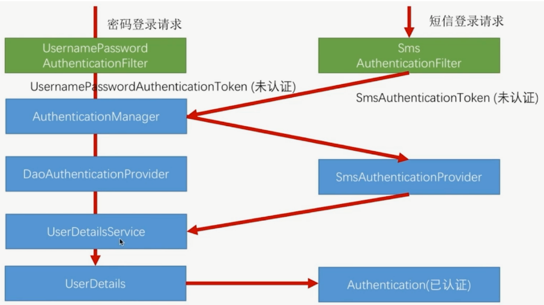

# 1. HttpBasic模式
>**HttpBasic**模式，将用户名和密码使用**Base64**模式加密。例如：用户名:user,密码root,就会将`user:root`进行加密,得到`dXNlcjpyb290`
>
>HTTP请求使用Authorization作为Header，值为`Basic dXNlcjpyb290`发送到服务端
>
>服务器接受请求,被`BasicAuthenticationFilter`拦截，提取`Authorization`的Header值，再用Base64进行解码，最后将用户名和密码和解码的结果进行比对

# 2. FormLogin模式
- 客制化登录界面
- 加密
- 角色、资源权限控制(role不能和authorities一起用，分开用可以)
- 登录成功失败的处理

# 3. Session会话管理

- 创建Session方法
  - **always**：如果当前请求没有session存在，Spring Security创建一个session。
  - **ifRequired（默认）**： Spring Security在需要时才创建session
  - **never**： Spring Security将永远不会主动创建session，但是如果session已经存在，它将使用该session
  - **stateless**：Spring Security不会创建或使用任何session。适合于接口型的无状态应用，该方式节省资源

- 会话超时及处理

- 固话技术:防止非法获取session和cookie

- cookie:防止通过脚本获取cookie,以及限制使用http或者https来发送cookie
- 限制一个用户的登录数量

# 4. RBAC权限管理

> 基于角色权限控制: 用户--用户角色--角色--角色权限--权限

> 步骤:

1. 继承`WebSecurityConfigurerAdapter`,重写`configure(HttpSecurity http) `和`configure(AuthenticationManagerBuilder auth)`
   - `configure(HttpSecurity http)`: 配置一些基本信息,通过权限表达式设置url权限
   - `configure(AuthenticationManagerBuilder auth)`,从`UserDetailService`中设置用户角色权限
2. 实体类`User`实现`UserDetails`(也可以用装饰者模式),添加getter,setter,用不到的字段都返回true
3. 实现`UserDetailService`, 重写`loadUserByUsername`
   - 根据`username`从数据库中获取`User`
   - 根据`username`获取对应角色
   - 根据这些角色查询出对应的权限
   - 把角色和权限设置到`User`的`authorities`字段上(可以使用`AuthorityUtils.commaSeparatedStringToAuthorityList`工具进行转换)

>Tip: 权限表达式(类SecurityExpressionRoot)
>
>方法权限控制,`WebSecurityConfigurerAdapter`的实现类上加入`@EnableGlobalMethodSecurity(prePostEnabled = true)`

# 5. Remember me

- 保存cookie到本地
- 设置cookie时间
- 保存cookie到数据库

# 6. Logout

- 登出
- 删cookie

# 7. ImageCode

> 使用一种图片验证码框架比如(kaptcha),自行实现`spring`的`filter`,SpringSecurity中在`UsernamePasswordAuthenticationFilter`前添加一个`filter`就可以了

# 8. Smscode

> 具体流程

1. 思路和ImageCode类似,但是登录时`springsecurity`并不知道你的请求,所以需要继承`AbstractAuthenticationProcessingFilter`来替代`UsernamePasswordAuthenticationFilter`,写法就直接copy了,去掉`password`字段.

2. `UsernamePasswordAuthenticationToken`也跟着copy一个

3. `provider`要根据`AuthenticationProvider`来实现,进而替代`DaoAuthenticationProvider`

# 9. JWT

> JWT组成:加密方式+(过期时间+用户名+时间)+签名

- 提供生成JWT生成的接口,刷新的接口
- 添加一个JWT的过滤器,放在`UsernamePasswordAuthenticationFilter`之前

# 10. 跨域问题

> 加个`cors`就可以了,不加的话任何配置跨域的方案都不起作用,加了后尽量使用`springsecurity`的跨域配置.